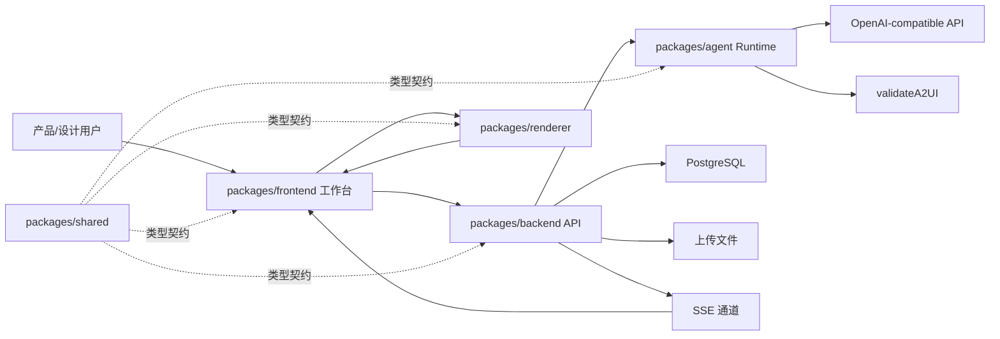

# 系统设计

## 1. 设计目标

平台面向产品经理和设计人员，提供通过对话生成、修改、预览和导出 A2UI UI 的单用户工作台。系统用 A2UI v0.9、Basic Catalog 和 `validateA2UI` 限制模型输出，避免任意代码生成。

## 2. 总体架构



## 3. 模块边界

### `packages/frontend`

负责工作台 UI、路由、Pinia 状态、HTTP API 调用、SSE 接收、Renderer 接入和导入导出入口。

不负责：A2UI 协议渲染核心、模型调用、A2UI 校验、数据库访问。

### `packages/renderer`

负责 A2UI v0.9 消息处理、surface/component/data model、Vue3 渲染、Basic Catalog 组件、action/error 派发。

不负责：后端 API 调用、会话持久化、Agent 修复逻辑、工作台业务状态。

### `packages/backend`

负责 Express API、Prisma、PostgreSQL、SSE、文件上传、skills、events、snapshots、Renderer action/error 记录和 Agent run 编排。

不负责：直接调用 OpenAI-compatible API、直接生成 A2UI 草稿、绕过 Agent/validateA2UI 提交模型输出。

### `packages/agent`

负责 Agent Runtime、上下文构建、prompt、模型调用、输出解析、`validateA2UI` 和三次修复循环。

不负责：直接写数据库、直接访问任意本地路径、开放 HTTP API、外部 HTTP/API 工具。

### `packages/shared`

负责共享类型。跨模块类型应优先放在这里，避免各模块重复定义 DTO。

## 4. 依赖方向

```text
shared
  -> renderer
  -> agent
  -> backend
  -> frontend

frontend -> renderer
backend  -> agent
```

约束：

- `shared` 不依赖业务模块。
- `renderer` 不依赖 `backend`。
- `agent` 不直接写数据库。
- `frontend` 不直接调用模型，不直接访问数据库。
- 跨模块 DTO 和协议类型优先放入 `shared`。

## 5. 成功链路

1. 用户在 `frontend` 中创建或打开会话。
2. 用户输入需求，或上传 `.txt` 文件并发送生成指令。
3. `backend` 创建用户消息和 Agent run。
4. `agent` 构建上下文，调用模型生成 A2UI 草稿。
5. `agent` 调用 `validateA2UI`。
6. 校验失败时进入 repair prompt，最多重试 3 次。
7. 校验通过后，`backend` 保存 assistant message、A2UI events 和 surface snapshot。
8. `backend` 通过 SSE 或响应发送合法 A2UI 消息。
9. `renderer` 更新 surface 状态并渲染 UI。

## 6. 失败链路

1. 模型输出非 JSON、协议非法或 Catalog 越界。
2. `validateA2UI` 返回错误。
3. `agent` 构建修复 prompt 并重试。
4. 三次仍失败时，Agent run 标记为 `FAILED`。
5. 后端不提交 A2UI events，不生成新的 snapshot。
6. 前端展示结构化失败信息。

## 7. 事务边界

Agent 成功提交时，后端必须在同一个事务内：

1. 更新 `agent_runs.status = committed`。
2. 创建 assistant message。
3. 创建 A2UI event。
4. 创建 surface snapshot。
5. 更新 current snapshot。
6. 更新 session last run。

事务提交后才能发送 SSE。

