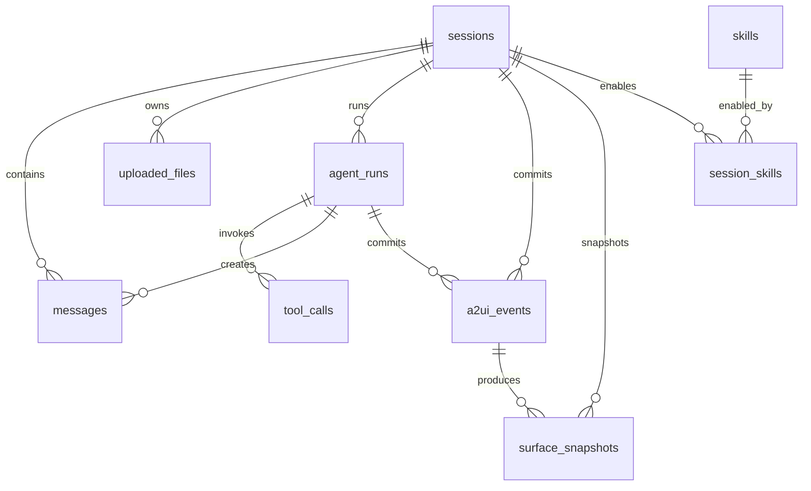

# 全栈 Agent 平台数据库 Schema 设计 v0.1

## 1. 设计目标

本文档定义全栈 Agent 平台 MVP 阶段的 PostgreSQL 数据模型。数据库需要支持单用户无登录工作台，但数据结构应预留后续多用户、Catalog 选择、会话分支、回滚和协作能力。

核心目标：

- 保存完整会话历史。
- 保存用户消息、assistant 消息和系统消息。
- 保存上传 `.txt` 文件内容。
- 保存文本型 skills 及会话启用关系。
- 保存 Agent run、校验尝试和工具调用日志。
- 保存已通过校验的 A2UI event 批次。
- 保存每次提交后的 surface snapshot。
- 支持历史回放、导入导出、调试和后续 diff/rollback。

## 2. 总体关系



MVP 不做登录，因此不设计 `users` 表。后续如果增加多用户，可在 `sessions`、`skills`、`uploaded_files` 等表上增加 `owner_user_id`。

## 3. 通用约定

### 3.1 主键

所有业务表使用 UUID 主键：

```sql
id uuid primary key default gen_random_uuid()
```

需要启用 PostgreSQL 扩展：

```sql
create extension if not exists pgcrypto;
```

### 3.2 时间字段

除关系表外，核心表统一包含：

```sql
created_at timestamptz not null default now()
updated_at timestamptz not null default now()
```

`updated_at` 由应用层或数据库 trigger 维护。

### 3.3 删除策略

MVP 使用软删除：

```sql
deleted_at timestamptz null
```

列表查询默认过滤 `deleted_at is null`。导出和调试接口可按需包含软删除数据。

### 3.4 JSONB 使用原则

JSONB 用于协议数据、快照、模型配置和校验结果。需要可筛选、可关联、可排序的字段应拆成普通列。

建议拆列：

- 状态。
- 类型。
- session 关系。
- attempt 次数。
- surfaceId。
- catalogId。
- model name。
- 创建时间。

建议 JSONB：

- A2UI messages。
- surface snapshot。
- validation result。
- model request/response 摘要。
- tool input/output。
- runtime metadata。

## 4. 枚举类型

建议用 PostgreSQL enum 或应用层 string enum。MVP 可优先使用 `text check (...)`，迁移更轻。

### 4.1 session_status

```text
active
archived
deleted
```

### 4.2 message_role

```text
user
assistant
system
tool
```

### 4.3 message_kind

```text
chat
agent_status
validation_error
renderer_action
renderer_error
import_notice
export_notice
```

### 4.4 agent_run_status

```text
pending
running
committed
failed
cancelled
```

### 4.5 tool_call_status

```text
running
succeeded
failed
```

### 4.6 a2ui_event_status

```text
committed
reverted
ignored
```

### 4.7 uploaded_file_status

```text
ready
failed
deleted
```

## 5. 表结构

## 5.1 sessions

保存一次 UI 创作会话。MVP 单用户，因此会话就是最高层业务容器。

```sql
create table sessions (
  id uuid primary key default gen_random_uuid(),
  title text not null default '未命名会话',
  description text null,
  status text not null default 'active',

  catalog_id text not null,
  catalog_version text not null,
  renderer_version text not null,

  model_provider text not null default 'openai-compatible',
  model_name text not null,
  model_config jsonb not null default '{}'::jsonb,

  current_snapshot_id uuid null,
  last_agent_run_id uuid null,
  metadata jsonb not null default '{}'::jsonb,

  created_at timestamptz not null default now(),
  updated_at timestamptz not null default now(),
  deleted_at timestamptz null,

  constraint sessions_status_check
    check (status in ('active', 'archived', 'deleted'))
);
```

字段说明：

- `catalog_id`：MVP 固定 Basic Catalog，仍需要落库以支持后续多 Catalog。
- `catalog_version`：用于后续 Catalog 迁移。
- `renderer_version`：记录生成时的 Renderer 能力版本。
- `model_config`：保存 temperature、maxTokens、baseUrl 标识等非敏感配置；`apiKey` 不应明文入库。
- `current_snapshot_id`：指向当前最新 snapshot，外键可在 `surface_snapshots` 创建后补充。
- `metadata`：保存 UI 偏好、会话摘要状态等扩展信息。

索引：

```sql
create index idx_sessions_status_updated_at
  on sessions (status, updated_at desc)
  where deleted_at is null;

create index idx_sessions_catalog_id
  on sessions (catalog_id)
  where deleted_at is null;
```

## 5.2 messages

保存会话内的消息，包括用户输入、assistant 回复、工具消息和系统提示。

```sql
create table messages (
  id uuid primary key default gen_random_uuid(),
  session_id uuid not null references sessions(id) on delete cascade,
  agent_run_id uuid null,

  role text not null,
  kind text not null default 'chat',
  content text not null default '',

  attachments jsonb not null default '[]'::jsonb,
  a2ui_event_ids jsonb not null default '[]'::jsonb,
  metadata jsonb not null default '{}'::jsonb,

  created_at timestamptz not null default now(),
  updated_at timestamptz not null default now(),
  deleted_at timestamptz null,

  constraint messages_role_check
    check (role in ('user', 'assistant', 'system', 'tool')),
  constraint messages_kind_check
    check (kind in (
      'chat',
      'agent_status',
      'validation_error',
      'renderer_action',
      'renderer_error',
      'import_notice',
      'export_notice'
    ))
);
```

字段说明：

- `agent_run_id`：assistant 消息通常关联生成它的 Agent run。
- `attachments`：引用上传文件或导入产物，例如 `[{ "type": "uploaded_file", "id": "..." }]`。
- `a2ui_event_ids`：assistant 消息提交的 A2UI event id 列表。
- `metadata`：保存 token 用量、模型摘要、UI 展示状态等。

索引：

```sql
create index idx_messages_session_created_at
  on messages (session_id, created_at asc)
  where deleted_at is null;

create index idx_messages_agent_run_id
  on messages (agent_run_id)
  where agent_run_id is not null;
```

## 5.3 uploaded_files

保存会话中上传的 `.txt` 文件。MVP 直接保存文本内容，后续可切换对象存储。

```sql
create table uploaded_files (
  id uuid primary key default gen_random_uuid(),
  session_id uuid not null references sessions(id) on delete cascade,

  original_name text not null,
  mime_type text not null default 'text/plain',
  extension text not null default '.txt',
  size_bytes integer not null,
  encoding text not null default 'utf-8',
  content text not null,
  content_sha256 text null,

  status text not null default 'ready',
  error_message text null,
  metadata jsonb not null default '{}'::jsonb,

  created_at timestamptz not null default now(),
  updated_at timestamptz not null default now(),
  deleted_at timestamptz null,

  constraint uploaded_files_status_check
    check (status in ('ready', 'failed', 'deleted')),
  constraint uploaded_files_extension_check
    check (extension = '.txt')
);
```

索引：

```sql
create index idx_uploaded_files_session_created_at
  on uploaded_files (session_id, created_at desc)
  where deleted_at is null;
```

## 5.4 skills

保存用户导入或创建的文本 skill。MVP skill 只是文本指令，不具备代码执行能力。

```sql
create table skills (
  id uuid primary key default gen_random_uuid(),

  name text not null,
  description text null,
  content text not null,
  source_type text not null default 'manual',
  source_file_id uuid null references uploaded_files(id) on delete set null,

  version integer not null default 1,
  is_active boolean not null default true,
  metadata jsonb not null default '{}'::jsonb,

  created_at timestamptz not null default now(),
  updated_at timestamptz not null default now(),
  deleted_at timestamptz null
);
```

字段说明：

- `source_type`：建议值为 `manual`、`uploaded_txt`、`imported`。
- `source_file_id`：如果 skill 来自 `.txt` 文件，则关联上传文件。
- `version`：同名 skill 后续编辑时可以递增。

索引：

```sql
create index idx_skills_active_updated_at
  on skills (is_active, updated_at desc)
  where deleted_at is null;
```

## 5.5 session_skills

保存会话启用的 skills。

```sql
create table session_skills (
  id uuid primary key default gen_random_uuid(),
  session_id uuid not null references sessions(id) on delete cascade,
  skill_id uuid not null references skills(id) on delete cascade,

  enabled boolean not null default true,
  enabled_at timestamptz not null default now(),
  disabled_at timestamptz null,
  metadata jsonb not null default '{}'::jsonb,

  unique (session_id, skill_id)
);
```

索引：

```sql
create index idx_session_skills_session_enabled
  on session_skills (session_id, enabled);
```

## 5.6 agent_runs

保存一次 Agent run。一次 run 可以包含最多 3 次模型生成或修复 attempt。

```sql
create table agent_runs (
  id uuid primary key default gen_random_uuid(),
  session_id uuid not null references sessions(id) on delete cascade,
  trigger_message_id uuid null references messages(id) on delete set null,

  status text not null default 'pending',
  intent text null,

  model_provider text not null default 'openai-compatible',
  model_name text not null,
  model_config jsonb not null default '{}'::jsonb,

  attempt_count integer not null default 0,
  max_attempts integer not null default 3,

  context_summary text null,
  input_snapshot_id uuid null,
  output_snapshot_id uuid null,

  assistant_message_id uuid null,
  failure_reason text null,
  validation_summary jsonb not null default '{}'::jsonb,
  token_usage jsonb not null default '{}'::jsonb,
  metadata jsonb not null default '{}'::jsonb,

  started_at timestamptz null,
  completed_at timestamptz null,
  created_at timestamptz not null default now(),
  updated_at timestamptz not null default now(),
  deleted_at timestamptz null,

  constraint agent_runs_status_check
    check (status in ('pending', 'running', 'committed', 'failed', 'cancelled'))
);
```

字段说明：

- `intent`：例如 `CREATE_UI`、`MODIFY_UI`、`EXPLAIN_UI`、`HANDLE_ACTION`。
- `input_snapshot_id`：run 开始时使用的 surface snapshot。
- `output_snapshot_id`：run 成功提交后的 surface snapshot。
- `validation_summary`：保存最终校验结果摘要。
- `token_usage`：保存输入、输出、总 token 和估算成本。

索引：

```sql
create index idx_agent_runs_session_created_at
  on agent_runs (session_id, created_at desc)
  where deleted_at is null;

create index idx_agent_runs_status
  on agent_runs (status)
  where deleted_at is null;
```

## 5.7 tool_calls

保存 Agent Runtime 中工具调用日志。MVP 主要记录 `validateA2UI`。

```sql
create table tool_calls (
  id uuid primary key default gen_random_uuid(),
  agent_run_id uuid not null references agent_runs(id) on delete cascade,
  session_id uuid not null references sessions(id) on delete cascade,

  tool_name text not null,
  status text not null default 'running',
  attempt_index integer not null,

  input_summary jsonb not null default '{}'::jsonb,
  output jsonb null,
  error_message text null,
  duration_ms integer null,

  created_at timestamptz not null default now(),
  updated_at timestamptz not null default now(),

  constraint tool_calls_status_check
    check (status in ('running', 'succeeded', 'failed'))
);
```

字段说明：

- `attempt_index`：第几次生成或修复尝试，从 1 开始。
- `input_summary`：不建议保存完整超大 prompt，可保存消息数量、组件数量、catalogId、snapshotId 等摘要。
- `output`：保存校验结果，例如 `valid`、`errors`、`warnings`。

索引：

```sql
create index idx_tool_calls_run_attempt
  on tool_calls (agent_run_id, attempt_index);

create index idx_tool_calls_session_created_at
  on tool_calls (session_id, created_at desc);
```

## 5.8 a2ui_events

保存已通过校验并提交的 A2UI 消息批次。Renderer 和历史回放都应以此为主要事件源。

```sql
create table a2ui_events (
  id uuid primary key default gen_random_uuid(),
  session_id uuid not null references sessions(id) on delete cascade,
  agent_run_id uuid null references agent_runs(id) on delete set null,
  message_id uuid null references messages(id) on delete set null,

  sequence integer not null,
  status text not null default 'committed',

  catalog_id text not null,
  catalog_version text not null,
  renderer_version text not null,

  surface_ids text[] not null default '{}',
  messages jsonb not null,
  validation_result jsonb not null,
  metadata jsonb not null default '{}'::jsonb,

  created_at timestamptz not null default now(),
  updated_at timestamptz not null default now(),
  deleted_at timestamptz null,

  constraint a2ui_events_status_check
    check (status in ('committed', 'reverted', 'ignored')),
  unique (session_id, sequence)
);
```

字段说明：

- `sequence`：会话内递增序号，用于回放顺序。
- `surface_ids`：本批消息涉及的 surface id。
- `messages`：A2UI v0.9 server-to-client 消息数组。
- `validation_result`：保存 `validateA2UI` 的最终通过结果。
- `status`：后续支持 rollback 时可将旧 event 标记为 `reverted`。

索引：

```sql
create index idx_a2ui_events_session_sequence
  on a2ui_events (session_id, sequence asc)
  where deleted_at is null;

create index idx_a2ui_events_agent_run_id
  on a2ui_events (agent_run_id)
  where agent_run_id is not null;

create index idx_a2ui_events_surface_ids
  on a2ui_events using gin (surface_ids);
```

## 5.9 surface_snapshots

保存每次提交后的 materialized surface 状态。Agent 修改 UI 时优先读取最新 snapshot。

```sql
create table surface_snapshots (
  id uuid primary key default gen_random_uuid(),
  session_id uuid not null references sessions(id) on delete cascade,
  a2ui_event_id uuid null references a2ui_events(id) on delete set null,
  agent_run_id uuid null references agent_runs(id) on delete set null,

  sequence integer not null,
  is_current boolean not null default false,

  catalog_id text not null,
  catalog_version text not null,
  renderer_version text not null,

  surface_count integer not null default 0,
  component_count integer not null default 0,
  snapshot jsonb not null,
  summary text null,
  metadata jsonb not null default '{}'::jsonb,

  created_at timestamptz not null default now(),
  updated_at timestamptz not null default now(),
  deleted_at timestamptz null,

  unique (session_id, sequence)
);
```

字段说明：

- `sequence`：会话内 snapshot 递增序号，通常与 A2UI event sequence 对齐。
- `is_current`：同一个 session 应只有一个当前 snapshot。
- `snapshot`：保存完整 surface group 状态。
- `summary`：给 Agent 使用的自然语言摘要，可异步生成。

建议约束：

```sql
create unique index idx_surface_snapshots_one_current
  on surface_snapshots (session_id)
  where is_current = true and deleted_at is null;
```

索引：

```sql
create index idx_surface_snapshots_session_sequence
  on surface_snapshots (session_id, sequence desc)
  where deleted_at is null;

create index idx_surface_snapshots_agent_run_id
  on surface_snapshots (agent_run_id)
  where agent_run_id is not null;
```

## 5.10 renderer_events

建议单独保存 Renderer 回传的 `action` 和 `error`，避免塞入普通 messages 后难以检索。MVP 可只记录，不触发业务。

```sql
create table renderer_events (
  id uuid primary key default gen_random_uuid(),
  session_id uuid not null references sessions(id) on delete cascade,

  event_type text not null,
  surface_id text not null,
  source_component_id text null,
  name text null,
  payload jsonb not null,

  handled boolean not null default false,
  handled_agent_run_id uuid null references agent_runs(id) on delete set null,
  error_message text null,
  metadata jsonb not null default '{}'::jsonb,

  created_at timestamptz not null default now(),
  updated_at timestamptz not null default now(),

  constraint renderer_events_type_check
    check (event_type in ('action', 'error'))
);
```

索引：

```sql
create index idx_renderer_events_session_created_at
  on renderer_events (session_id, created_at desc);

create index idx_renderer_events_surface_id
  on renderer_events (surface_id);
```

## 6. JSONB 结构约定

### 6.1 a2ui_events.messages

必须是 A2UI v0.9 server-to-client 消息数组：

```json
[
  {
    "version": "v0.9",
    "createSurface": {
      "surfaceId": "main",
      "catalogId": "https://a2ui.org/specification/v0_9/catalogs/basic/catalog.json"
    }
  }
]
```

约束：

- 只能保存通过 `validateA2UI` 的消息。
- 不保存模型未通过校验的草稿。
- 未通过校验的草稿只能保存到 Agent run 调试元数据或日志系统中，且应限制大小。

### 6.2 surface_snapshots.snapshot

建议结构：

```json
{
  "version": "v0.9",
  "surfaces": {
    "main": {
      "surfaceId": "main",
      "catalogId": "https://a2ui.org/specification/v0_9/catalogs/basic/catalog.json",
      "theme": {},
      "sendDataModel": true,
      "components": {
        "root": {
          "id": "root",
          "component": "Column",
          "children": ["title"]
        }
      },
      "dataModel": {}
    }
  }
}
```

约束：

- `components` 使用组件 id 到组件配置的 map。
- `dataModel` 保存该 surface 的当前数据。
- snapshot 是后端根据 committed events 计算出来的 materialized state。

### 6.3 agent_runs.validation_summary

```json
{
  "valid": true,
  "attempts": 1,
  "lastErrors": [],
  "lastWarnings": []
}
```

### 6.4 tool_calls.output

`validateA2UI` 输出：

```json
{
  "valid": false,
  "errors": [
    {
      "code": "UNKNOWN_COMPONENT",
      "path": "/updateComponents/components/2/component",
      "message": "组件 DataTable 不在固定 Catalog 中"
    }
  ],
  "warnings": [],
  "normalizedMessages": []
}
```

## 7. 外键补充

由于 `sessions.current_snapshot_id`、`sessions.last_agent_run_id` 和 `agent_runs.output_snapshot_id` 存在循环引用，建议先建表，再补充外键：

```sql
alter table sessions
  add constraint sessions_current_snapshot_fk
  foreign key (current_snapshot_id)
  references surface_snapshots(id)
  on delete set null;

alter table sessions
  add constraint sessions_last_agent_run_fk
  foreign key (last_agent_run_id)
  references agent_runs(id)
  on delete set null;

alter table agent_runs
  add constraint agent_runs_output_snapshot_fk
  foreign key (output_snapshot_id)
  references surface_snapshots(id)
  on delete set null;

alter table agent_runs
  add constraint agent_runs_assistant_message_fk
  foreign key (assistant_message_id)
  references messages(id)
  on delete set null;

alter table messages
  add constraint messages_agent_run_fk
  foreign key (agent_run_id)
  references agent_runs(id)
  on delete set null;
```

## 8. 事务边界

### 8.1 提交成功 Agent run

校验通过后，后端应在一个数据库事务中完成：

1. 更新 `agent_runs.status = committed`。
2. 创建 assistant `messages`。
3. 创建 `a2ui_events`。
4. 计算并创建 `surface_snapshots`。
5. 将旧 `surface_snapshots.is_current` 置为 false。
6. 将新 snapshot 置为 `is_current = true`。
7. 更新 `sessions.current_snapshot_id`。
8. 更新 `sessions.last_agent_run_id`。
9. 更新 `sessions.updated_at`。

事务提交后，再通过 SSE 通知前端。

### 8.2 Agent run 失败

失败时应在一个事务中完成：

1. 更新 `agent_runs.status = failed`。
2. 写入 `failure_reason`。
3. 写入 `validation_summary`。
4. 创建 assistant 失败说明消息，或创建 `validation_error` 类型消息。
5. 不创建 `a2ui_events`。
6. 不创建新的 `surface_snapshots`。

## 9. 导入导出映射

### 9.1 导出会话

会话导出应包含：

- `sessions`
- `messages`
- `uploaded_files` 元数据和可选内容。
- `skills` 与 `session_skills`
- `a2ui_events`
- `surface_snapshots`
- `agent_runs` 摘要
- `tool_calls` 摘要

敏感字段不导出：

- API key。
- 完整模型请求中可能包含的隐藏 system prompt。
- 超大工具输入原文，除非用户显式选择。

### 9.2 导出 A2UI JSONL

从 `a2ui_events.messages` 按 `sequence` 展开为 JSONL，每行一个 A2UI 消息对象。

### 9.3 导出 Snapshot

导出当前 `surface_snapshots.snapshot`，附带：

- `catalogId`
- `catalogVersion`
- `rendererVersion`
- `createdAt`
- `sessionId`

## 10. 保留与演进

后续版本可能增加：

- `users`：多用户登录。
- `catalogs`：Catalog 导入、版本和选择。
- `session_branches`：会话分支。
- `snapshot_diffs`：snapshot 差异。
- `model_presets`：模型配置预设。
- `runtime_settings`：运行时全局设置。
- `http_tool_policies`：外部 HTTP/API 工具 allowlist 与权限。

MVP 表结构已预留以下字段以降低迁移成本：

- `sessions.catalog_id`
- `sessions.catalog_version`
- `sessions.renderer_version`
- `sessions.model_provider`
- `sessions.model_name`
- `sessions.model_config`
- `metadata jsonb`

## 11. 实现建议

- migration 文件中应先创建基础表，再创建循环外键。
- 所有列表接口默认按 `created_at desc` 或 `sequence asc` 使用索引。
- 大型 JSONB 字段不要频繁局部更新，优先整体追加事件和生成新 snapshot。
- Agent 草稿不要写入 `a2ui_events`，只保存通过校验的 committed events。
- 如果需要保存失败草稿，应限制大小并放入 `agent_runs.metadata` 或单独调试表。
- `apiKey` 等密钥不进入数据库明文字段，应使用环境变量或安全密钥管理。

