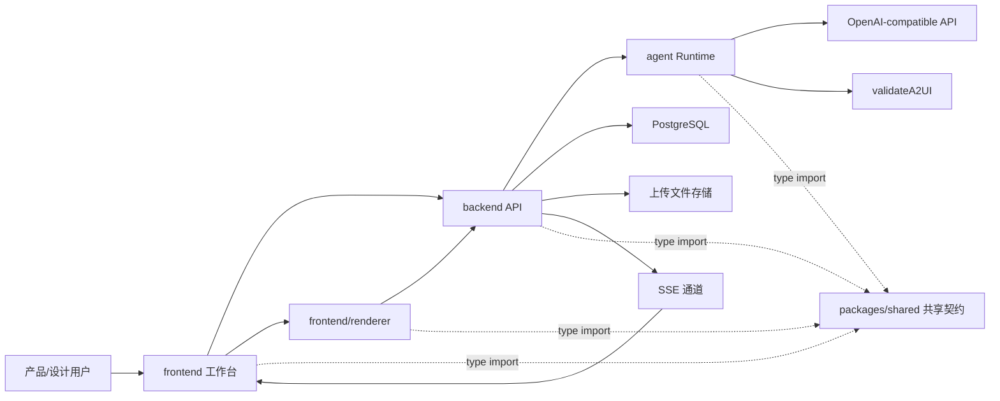
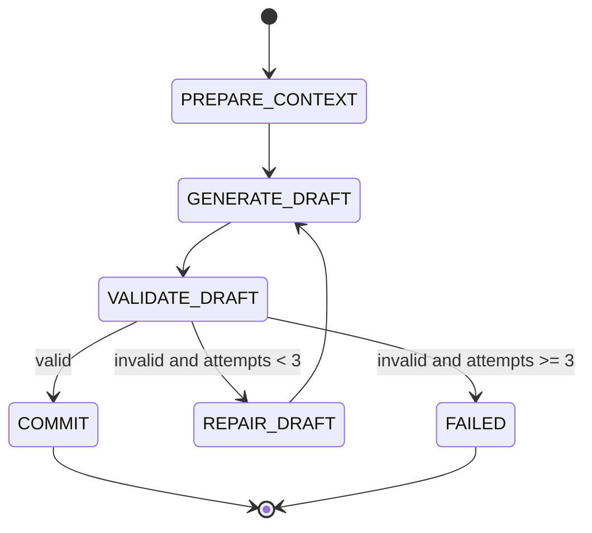

# 全栈 Agent 平台设计文档 v0.1

## 1. 设计目标

本文档基于 `docs/product/agent-platform-prd.md`，描述全栈 Agent 平台的系统设计。平台面向产品经理和设计人员，提供通过对话生成、修改、预览和导出 A2UI UI 的单用户工作台。

系统按四个一级业务模块组织：

- `frontend`：平台工作台、页面结构、会话交互、导入导出和调试界面。
- `frontend/renderer`：Vue3 A2UI v0.9 Renderer，负责解析和渲染合法 A2UI 消息。
- `backend`：Node.js API、PostgreSQL 持久化、文件处理、SSE 推送和业务编排。
- `agent`：受控 Agent Runtime、模型调用、上下文构建、A2UI 校验和修复闭环。

工程实现采用 pnpm workspace，并新增 `packages/shared` 作为跨模块契约包。`shared` 不属于独立业务模块，负责承载 API DTO、A2UI message、SSE event、Agent result 等共享类型，避免各业务模块重复定义协议。

核心设计原则：

- Agent 只能生成声明式 A2UI 数据，不能生成任意 HTML、JavaScript 或 CSS。
- Renderer 只消费通过校验的 A2UI 消息。
- Catalog 在 MVP 中固定，后续预留可选择和导入能力。
- Agent 输出必须经过 `validateA2UI` 校验，失败后进入修复循环。
- 会话、消息、A2UI events、surface snapshots 和 Agent run 必须可追踪、可回放。

## 2. 总体架构



一次 UI 生成的主流程：

1. 用户在 `frontend` 中创建或打开会话。
2. 用户输入需求，或上传 `.txt` 文件并发送生成指令。
3. `backend` 创建用户消息和 Agent run。
4. `agent` 构建上下文，调用模型生成 A2UI 草稿。
5. `agent` 强制调用 `validateA2UI`。
6. 如果校验失败，`agent` 将错误写入 repair prompt 并重试，最多 3 次。
7. 如果校验通过，`backend` 保存 assistant 消息、A2UI events 和 surface snapshot。
8. `backend` 通过 SSE 或批量响应发送合法 A2UI 消息。
9. `frontend/renderer` 更新本地 surface 状态并渲染 UI。

## 3. 模块边界

### 3.1 `frontend`

`frontend` 负责平台工作台体验，不直接实现 A2UI 协议核心逻辑。

职责：

- 左侧栏 tab 子模块导航。
- 右侧功能区域布局。
- 会话创建、加载、切换。
- 聊天输入、消息列表、发送状态。
- `.txt` 文件上传入口。
- skill 管理界面。
- 历史会话、A2UI events 和 snapshots 查看。
- 导入导出入口。
- Runtime 配置与 Agent run 日志查看。
- 接收后端 SSE 事件，并将 A2UI 消息交给 `frontend/renderer`。
- 接收 Renderer 的 `action` 和 `error`，转发给 `backend`。

不负责：

- 不直接调用模型。
- 不执行 A2UI 校验。
- 不自行修复非法 A2UI。
- 不在工作台层解析组件树和数据绑定。

### 3.2 `frontend/renderer`

`frontend/renderer` 是 Vue3 A2UI v0.9 Renderer。它负责 A2UI 协议消息处理、状态模型、数据绑定和 UI 渲染。

职责：

- 处理 `createSurface`、`updateComponents`、`updateDataModel`、`deleteSurface`。
- 维护 `SurfaceGroupModel`、`SurfaceModel`、`ComponentModel` 和 `DataModel`。
- 基于 `root` 组件递归渲染 UI。
- 根据固定 Basic Catalog 映射 Vue 组件实现。
- 支持 `child`、`children` 和动态列表 children。
- 支持 JSON Pointer 数据读取和写回。
- 支持输入组件双向绑定。
- 支持 action context 动态值解析。
- 派发 `action` 和 `error` 客户端消息。
- 提供 missing child、unknown component、校验失败和表达式失败 fallback。

不负责：

- 不持久化会话。
- 不调用模型。
- 不决定 Agent 是否重试。
- 不接受未通过后端校验的消息作为正式提交。

### 3.3 `backend`

`backend` 是平台业务后端，负责 API、持久化、文件处理、SSE 和模块编排。

职责：

- 提供会话、消息、文件、skills、events、snapshots、runtime logs 的 HTTP API。
- 管理 PostgreSQL 数据读写。
- 读取和保存上传 `.txt` 文件。
- 调用 `agent` 执行生成或修改任务。
- 保存通过校验的 A2UI events。
- 计算和保存 surface snapshots。
- 通过 SSE 将已提交 A2UI 消息推送给前端。
- 接收 Renderer 的 `action` 和 `error`。
- 提供导入导出能力。

不负责：

- 不直接拼接 A2UI 组件。
- 不绕过 `agent` 和 `validateA2UI` 提交模型输出。
- 不做登录和多用户权限。

### 3.4 `agent`

`agent` 是受控 Agent Runtime，负责把用户意图转换成合法 A2UI 消息。

职责：

- 构建 Agent 上下文。
- 组织 prompt。
- 调用 OpenAI-compatible API。
- 解析模型输出。
- 强制执行 `validateA2UI`。
- 根据校验错误进行最多 3 次修复。
- 返回结构化成功或失败结果。
- 记录 Agent run、attempt 和 tool call 信息。

不负责：

- 不直接写前端状态。
- 不直接写数据库，除非通过 `backend` 提供的 repository 或 service。
- 不调用外部 HTTP/API 工具。
- 不读取任意本地路径；上传文件内容由 `backend` 注入上下文。

### 3.5 `packages/shared`

`packages/shared` 是工程层面的共享契约包，负责沉淀跨模块类型，不承载业务流程。

职责：

- 定义 A2UI v0.9 message、component、data model、surface snapshot 相关类型。
- 定义 API request/response DTO 类型。
- 定义 SSE event 类型。
- 定义 Agent input、Agent result、validation result、tool call 相关类型。
- 作为 `frontend`、`frontend/renderer`、`backend`、`agent` 的共同类型来源。

不负责：

- 不实现 API 请求。
- 不实现数据库访问。
- 不实现 Renderer 状态机。
- 不调用 Agent、模型或工具。
- 不引入 Vue、Express、Prisma 等运行时框架依赖。

约束：

- 跨模块类型变更应优先更新 `packages/shared`。
- 业务模块内不得复制定义 Session、Message、A2UIEvent、SurfaceSnapshot、SSEEvent、AgentResult 等共享 DTO。
- `packages/shared` 应保持轻量，优先只包含类型、常量、纯函数和必要的 Zod schema。

## 4. `frontend` 设计

### 4.1 页面结构

工作台采用两栏布局：

```text
+----------------------+------------------------------------------+
| 左侧栏 Tabs           | 右侧功能区域                              |
|                      |                                          |
| - 对话                | 当前子模块内容                            |
| - 预览                |                                          |
| - 历史                |                                          |
| - Skills             |                                          |
| - 导入导出            |                                          |
| - Runtime            |                                          |
+----------------------+------------------------------------------+
```

默认进入“对话”tab。对话页右侧功能区域建议拆成：

- 左侧聊天区：消息列表、输入框、上传文件入口、发送按钮。
- 右侧预览区：当前 surface 渲染结果、渲染状态、最近 action/error。

### 4.2 前端状态

建议前端维护以下状态：

- `activeTab`：当前左侧 tab。
- `sessions`：会话列表。
- `activeSessionId`：当前会话。
- `messages`：当前会话消息。
- `uploadedFiles`：当前会话文件。
- `skills`：skill 列表。
- `enabledSkillIds`：当前会话启用的 skills。
- `agentRuns`：当前会话 Agent run 日志。
- `a2uiEvents`：当前会话 A2UI event 批次。
- `surfaceSnapshots`：当前会话 snapshots。
- `streamStatus`：SSE 连接状态。

Renderer 内部状态不应混入普通工作台状态。工作台只向 Renderer 传入消息，Renderer 自己维护 surface 模型。

### 4.3 SSE 事件处理

前端建立会话级 SSE 连接：

```text
GET /api/sessions/:sessionId/stream
```

推荐事件类型：

- `agent_run_started`
- `agent_run_attempt`
- `agent_run_failed`
- `assistant_message`
- `a2ui_messages`
- `surface_snapshot`
- `tool_call`
- `heartbeat`

收到 `a2ui_messages` 后：

1. 工作台记录 event 元信息。
2. 将消息批次交给 `frontend/renderer` 的 `processMessages()`。
3. 更新预览状态。

### 4.4 Renderer 事件回传

Renderer 派发 action：

```text
POST /api/sessions/:sessionId/renderer/action
```

Renderer 派发 error：

```text
POST /api/sessions/:sessionId/renderer/error
```

MVP 中 action 可先记录日志，不强制触发新的 Agent run。后续可以支持 action 驱动 Agent 继续生成 UI 或处理业务流程。

## 5. `frontend/renderer` 设计

### 5.1 核心对象

```text
MessageProcessor
  -> SurfaceGroupModel
    -> SurfaceModel
      -> SurfaceComponentsModel
      -> DataModel
      -> Catalog
      -> Theme
```

核心对象职责：

- `MessageProcessor`：接收 A2UI v0.9 消息并更新模型。
- `SurfaceGroupModel`：管理多个 surface。
- `SurfaceModel`：维护单个 surface 的组件、数据、主题和事件派发。
- `SurfaceComponentsModel`：以 map 形式保存 `ComponentModel`。
- `ComponentModel`：保存单个组件的 `id`、`component` 和 props。
- `DataModel`：提供 JSON Pointer 读写和 path 订阅。
- `DataContext`：解析动态值、相对路径和函数调用。
- `ComponentContext`：给组件实现提供当前组件、数据上下文、子组件构建和 action 派发能力。
- `ComponentImplementation`：固定 Catalog 中每个组件的 Vue 实现。

### 5.2 消息处理

`createSurface`：

- 校验 `surfaceId` 不重复。
- 根据 `catalogId` 绑定固定 Catalog。
- 初始化 `SurfaceModel`。
- 保存 `theme` 和 `sendDataModel`。

`updateComponents`：

- 新增或更新组件。
- 如果同一个 `id` 的 `component` 类型变化，应重建组件模型。
- 不存在的 child 在流式场景中显示 missing child fallback。

`updateDataModel`：

- 默认 path 为 `/`。
- 支持根替换和深层路径更新。
- 设置深层路径时自动创建中间对象或数组。
- 省略 `value` 时表示删除目标路径。

`deleteSurface`：

- 删除 surface。
- 释放组件、数据和监听器。

### 5.3 数据绑定

Renderer 需要支持以下动态值：

- 字面量：直接传给组件。
- `{ "path": "/foo/bar" }`：从 `DataModel` 读取。
- 函数调用：MVP 只支持固定 Catalog 中已实现函数。

输入组件写回规则：

- 只有原始属性是 `{ "path": "..." }` 时才注入 setter。
- `TextField` 写回 string。
- `CheckBox` 写回 boolean。
- `ChoicePicker` 写回 string array。
- `Slider` 写回 number。
- `DateTimeInput` 写回 string。

### 5.4 子组件渲染

固定子组件：

```json
{
  "children": ["title", "content", "submit"]
}
```

动态子组件：

```json
{
  "children": {
    "path": "/items",
    "componentId": "itemTemplate"
  }
}
```

动态列表必须为每个 item 传入正确的 `basePath`，例如 `/items/0`、`/items/1`。子组件默认继承父组件的 `DataContext`，避免相对路径解析到错误位置。

### 5.5 Basic Catalog 组件

MVP 必须实现：

- `Text`
- `Image`
- `Icon`
- `Video`
- `AudioPlayer`
- `Divider`
- `Row`
- `Column`
- `List`
- `Card`
- `Tabs`
- `Modal`
- `Button`
- `TextField`
- `CheckBox`
- `ChoicePicker`
- `Slider`
- `DateTimeInput`

实现顺序建议：

1. `Text`
2. `Row`
3. `Column`
4. `Button`
5. `TextField`
6. `Card`
7. `List`
8. 其余 Basic Catalog 组件

### 5.6 Renderer 测试

至少覆盖：

- create/update/delete surface。
- update components。
- update data model。
- JSON Pointer 深层读写。
- root 渲染。
- missing child 后续补齐。
- unknown component fallback。
- 动态列表 basePath。
- 输入组件写回 data model。
- Button action 派发。
- 组件卸载时释放监听器。

## 6. `backend` 设计

### 6.1 服务分层

建议后端分层：

```text
routes/controllers
  -> services
    -> repositories
      -> PostgreSQL
```

主要 service：

- `SessionService`
- `MessageService`
- `FileService`
- `SkillService`
- `AgentRunService`
- `A2UIEventService`
- `SurfaceSnapshotService`
- `RendererEventService`
- `ExportService`
- `StreamService`

### 6.2 核心 API 草案

会话：

- `POST /api/sessions`
- `GET /api/sessions`
- `GET /api/sessions/:sessionId`
- `PATCH /api/sessions/:sessionId`

消息与 Agent：

- `GET /api/sessions/:sessionId/messages`
- `POST /api/sessions/:sessionId/messages`
- `GET /api/sessions/:sessionId/agent-runs`

文件：

- `POST /api/sessions/:sessionId/files`
- `GET /api/sessions/:sessionId/files`

Skills：

- `POST /api/skills`
- `GET /api/skills`
- `PATCH /api/skills/:skillId`
- `POST /api/sessions/:sessionId/skills/:skillId/enable`
- `POST /api/sessions/:sessionId/skills/:skillId/disable`

A2UI：

- `GET /api/sessions/:sessionId/a2ui-events`
- `GET /api/sessions/:sessionId/surface-snapshots`
- `GET /api/sessions/:sessionId/stream`

Renderer 回传：

- `POST /api/sessions/:sessionId/renderer/action`
- `POST /api/sessions/:sessionId/renderer/error`

导入导出：

- `GET /api/sessions/:sessionId/export`
- `GET /api/sessions/:sessionId/export/a2ui.jsonl`
- `GET /api/sessions/:sessionId/export/snapshot.json`

### 6.3 数据库表职责

`sessions`：

- 保存会话标题、状态、固定 Catalog 信息、renderer 版本和模型信息。

`messages`：

- 保存 user、assistant 和 system 类型消息。
- assistant 消息与 Agent run 关联。

`uploaded_files`：

- 保存 `.txt` 文件名、大小、mime、文本内容、上传时间和 session 关联。

`skills`：

- 保存文本 skill。

`session_skills`：

- 保存会话启用的 skill。

`agent_runs`：

- 保存单次 Agent run 的状态、模型配置、开始结束时间、重试次数和失败原因。

`tool_calls`：

- 保存 `validateA2UI` 调用输入摘要、输出、错误和耗时。

`a2ui_events`：

- 保存通过校验的 A2UI 消息批次。

`surface_snapshots`：

- 保存每次提交后的 materialized surface 状态。

### 6.4 Surface Snapshot 生成

后端需要有一个轻量 snapshot builder，用于根据已提交 A2UI events 计算当前 surface 状态。它不需要渲染 UI，但要能复现协议状态：

- surfaces map。
- components map。
- data model。
- catalogId。
- theme。
- sendDataModel。

用途：

- 给 Agent 提供当前 UI 上下文。
- 支持历史回放。
- 支持导出。
- 支持后续 diff 和 rollback。

### 6.5 文件处理

MVP 仅支持 `.txt`：

- 限制文件扩展名。
- 限制文件大小。
- 使用 UTF-8 读取，必要时记录编码检测结果。
- 内容保存到 `uploaded_files.content`。
- 文件内容由 backend 注入 Agent 上下文，而不是让模型自由读取路径。

## 7. `agent` 设计

### 7.1 Runtime 状态机



### 7.2 Agent 上下文

一次 Agent run 的上下文包括：

- 当前用户输入。
- 当前会话最近 N 轮消息。
- 更早历史的会话摘要。
- 当前 surface snapshot。
- 当前会话上传的相关 `.txt` 文件内容。
- 当前会话启用的 skills。
- 固定 Basic Catalog 摘要。
- Renderer 约束。
- 输出契约。

上下文原则：

- 不把完整长历史无限传给模型。
- surface snapshot 优先于自然语言回忆。
- Catalog 摘要必须明确组件和字段边界。
- skills 只能作为指导，不改变协议约束。

### 7.3 Prompt 结构

推荐 prompt 结构：

```text
System:
你是 A2UI UI generation agent，只能输出合法 A2UI v0.9 JSON。

Developer:
平台规则、固定 Catalog 限制、禁止事项、输出契约。

Context:
会话摘要、最近消息、surface snapshot、上传文件、skills。

User:
用户最新输入。
```

修复 prompt：

```text
你上一次输出未通过 validateA2UI。
请只修复错误，不要改变用户意图，不要引入 Catalog 外组件。
以下是错误列表和上一版 JSON。
```

### 7.4 模型输出解析

模型输出必须是 JSON：

```json
{
  "assistantMessage": "说明文本",
  "a2uiMessages": []
}
```

解析规则：

- JSON 解析失败视为一次失败 attempt。
- `assistantMessage` 必须是 string。
- `a2uiMessages` 必须是 array。
- `a2uiMessages` 为空时表示仅文字回复，不更新 UI。
- 非空 `a2uiMessages` 必须进入 `validateA2UI`。

### 7.5 validateA2UI

`validateA2UI` 是 runtime 强制工具，不由模型决定是否调用。

输入：

```json
{
  "messages": [],
  "catalogId": "https://a2ui.org/specification/v0_9/catalogs/basic/catalog.json",
  "currentSnapshot": {}
}
```

输出：

```json
{
  "valid": false,
  "errors": [
    {
      "code": "UNKNOWN_COMPONENT",
      "path": "/updateComponents/components/2/component",
      "message": "组件 DataTable 不在固定 Catalog 中"
    }
  ],
  "warnings": [],
  "normalizedMessages": []
}
```

校验层级：

- 消息结构校验。
- Catalog schema 校验。
- 跨组件引用校验。
- surface 存在性校验。
- root 存在性校验。
- JSON Pointer 校验。
- 安全约束校验。

### 7.6 Agent 结果

成功结果：

```json
{
  "status": "COMMITTED",
  "assistantMessage": "已生成页面。",
  "a2uiMessages": [],
  "attemptCount": 1,
  "validation": {
    "valid": true,
    "errors": []
  }
}
```

失败结果：

```json
{
  "status": "FAILED",
  "assistantMessage": "生成的 A2UI 未能通过校验，请简化需求后重试。",
  "attemptCount": 3,
  "validation": {
    "valid": false,
    "errors": []
  }
}
```

## 8. 目录结构建议

项目采用 pnpm workspace，按 packages 组织：

```text
packages/
  shared/
    src/
      a2ui.ts
      api.ts
      agent.ts
      sse.ts
      index.ts
  frontend/
    src/
      components/
      views/
      stores/
      services/
      router.ts
      main.ts
  renderer/
    src/
      core/
      vue/
      styles.css
      index.ts
  backend/
    prisma/
      schema.prisma
    src/
      routes/
      services/
      repositories/
      stream/
      files/
      app.ts
      server.ts
  agent/
    src/
      runtime/
      context/
      prompts/
      model/
      tools/
      schemas/
      index.ts
```

模块依赖关系：

- `packages/frontend` 依赖 `packages/renderer` 和 `packages/shared`。
- `packages/renderer` 依赖 `packages/shared`。
- `packages/backend` 依赖 `packages/agent` 和 `packages/shared`。
- `packages/agent` 依赖 `packages/shared`。
- `packages/agent` 不依赖 `packages/frontend` 或 `packages/renderer`。
- `packages/renderer` 不依赖 `packages/backend`，只通过回调派发 action/error。

## 9. 实现顺序

建议按以下顺序实现：

1. 建立基础工程结构，并完善 `packages/shared` 共享类型契约。
2. 实现 `frontend/renderer` 的协议模型：`DataModel`、`ComponentModel`、`SurfaceModel`。
3. 实现 `MessageProcessor` 和最小组件集：`Text`、`Row`、`Column`、`Button`、`TextField`。
4. 实现 `backend` 的 session、message、a2ui_events、surface_snapshots 基础 API。
5. 实现 `validateA2UI` 工具。
6. 实现 `agent` 的非流式生成、校验和修复循环。
7. 实现 `frontend` 对话页与 Renderer 预览。
8. 接入 SSE 推送。
9. 实现文件上传和 skill 管理。
10. 补齐 Basic Catalog 组件。
11. 实现导入导出。
12. 增加测试、日志和调试面板。

## 10. 关键设计决策

- Agent 采用状态机式 Runtime，而不是复杂多 Agent 框架。
- 模型生成阶段不直接流式推送给 Renderer。
- 后端只提交通过 `validateA2UI` 的 A2UI 消息。
- MVP 固定 Catalog，但所有数据结构预留 `catalogId` 和 `catalogVersion`。
- 文件读取由后端完成，模型不能自由读取本地路径。
- MVP 不提供外部 HTTP/API 工具。
- Renderer 是独立协议渲染层，不和工作台业务状态混在一起。

## 11. 待后续细化

后续文档应继续拆分：

- `docs/product/agent-platform-db-schema.md`：PostgreSQL 表结构、索引和 JSONB 字段。
- `docs/product/agent-platform-api.md`：完整 HTTP/SSE API。
- `docs/product/agent-platform-module-specs.md`：可交给编码 Agent 执行的模块实现规格。
- `docs/frontend/renderer/vue3-a2ui-renderer-design.md`：Vue3 Renderer 详细实现设计。
