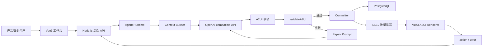

# 全栈 Agent 平台 PRD v0.1

## 1. 执行摘要

### 问题陈述

产品经理和设计人员需要一种不写前端代码也能快速探索、调整和沉淀 UI 想法的方式。传统原型工具依赖大量手工布局，通用 AI 代码生成又难以验证、安全性不足，并且容易脱离受控组件体系。

### 解决方案

构建一个面向单用户的全栈 Agent 无代码 A2UI 创作平台。用户通过对话或上传 `.txt` 文件描述 UI 需求，Node.js 后端中的受控 Agent Runtime 在固定 Catalog 约束内生成 A2UI v0.9 消息，并在提交前完成校验和修复；前端使用 Vue3 A2UI Renderer 实时渲染合法的 A2UI UI。

### 成功指标

- 用户能在 3 分钟内从自然语言或 `.txt` 文件生成首个可渲染 UI。
- 已提交的 A2UI 消息批次中，至少 95% 在最终提交前通过 Schema 与 Catalog 校验。
- 同一个 UI 支持至少 5 轮连续对话修改，并完整保留会话历史和 surface 状态。
- 已提交的 A2UI 组件 100% 来自 MVP 固定 Catalog。
- 每次已提交的 Agent run 都记录模型配置、校验结果、重试次数、A2UI events 和最终 surface snapshot。

## 2. 用户体验与功能

### 用户角色

- 产品经理：用自然语言描述页面流程、表单、列表和交互，快速创建 UI 草稿。
- 设计人员：在不写代码的情况下迭代布局、组件选择和视觉结构。
- 平台维护者：配置模型参数、固定 Catalog 元信息、skill 文本和运行时约束。

### 前端页面结构

前端应用采用两区域工作台结构：

- 左侧栏：通过 tab 选择子模块。
- 右侧功能区域：展示当前子模块的主要功能界面。

MVP 左侧栏 tab：

- 对话：通过聊天创建和修改 UI。
- 预览：展示 A2UI 渲染结果，并查看 action/error。
- 历史：查看历史会话、消息、A2UI event 批次和 snapshot。
- Skills：管理导入的 skill 文本及其启用状态。
- 导入导出：处理 `.txt`、A2UI JSON/JSONL 和会话导出。
- Runtime：查看模型配置、校验配置和 Agent run 日志。

默认进入“对话”子模块。右侧功能区域应同时支持对话与实时预览，让用户可以一边描述修改，一边查看渲染结果。

### 用户故事

作为产品经理，我希望用自然语言描述 UI，这样我可以不写代码就创建可运行原型。

验收标准：

- 用户无需登录即可创建新会话。
- 用户可以直接在聊天框提交文本需求。
- Agent 只使用固定 Catalog 生成合法 A2UI v0.9 消息。
- 校验通过后，Vue3 Renderer 能显示生成的 UI。

作为设计人员，我希望通过持续对话修改同一个 UI，这样我可以快速迭代结构和内容。

验收标准：

- 用户可以基于当前 surface 继续提交修改指令。
- Agent 能在上下文中接收当前 surface snapshot。
- Agent 可以生成增量 `updateComponents` 和 `updateDataModel` 消息。
- 每次修改都保存为消息、A2UI event 批次和 surface snapshot。

作为产品经理，我希望上传 `.txt` 需求文档，这样 Agent 可以从已有需求说明中生成 UI。

验收标准：

- 用户可以在工作台上传 `.txt` 文件。
- 后端读取并保存文件内容。
- 文件内容会被加入下一次 Agent run 的上下文。
- 上传文件与当前会话关联。

作为平台维护者，我希望导入 skill 文本，这样 Agent 可以遵循特定领域的 UI 生成规范。

验收标准：

- 用户可以创建或上传文本型 skill。
- skill 可以在会话中启用。
- 已启用 skill 会进入 Agent 上下文。
- skill 不能带来任意代码执行能力。

作为用户，我希望导出生成的 UI 产物，这样我可以在平台外审查或复用它们。

验收标准：

- 用户可以将当前 A2UI 消息流导出为 JSONL。
- 用户可以将当前 surface snapshot 导出为 JSON。
- 用户可以将当前会话历史导出为 JSON。
- MVP 导出内容中包含固定 Catalog 引用；Catalog 导入导出能力预留到后续版本。

### 非目标

- MVP 不做登录或多用户权限系统。
- Agent 不生成任意 HTML、JavaScript 或 CSS。
- MVP 不做自由拖拽画布编辑器。
- MVP 不提供外部 HTTP/API 调用工具。
- MVP 不支持用户选择 Catalog，但会预留字段和界面位置。
- MVP 不做复杂插件沙箱；skill 仅作为文本指令。
- MVP 不引入多 Agent 编排框架。

## 3. AI 系统需求

### Agent Runtime 概览

Agent 采用受控运行时状态机实现，而不是不受限制的自治 Agent。它负责把用户意图转换成合法 A2UI 消息，但不能直接修改前端状态。只有通过校验的 A2UI 消息才能被提交、持久化并发送给 Renderer。

Runtime 状态：

- `PREPARE_CONTEXT`
- `GENERATE_DRAFT`
- `VALIDATE_DRAFT`
- `REPAIR_DRAFT`
- `COMMIT`
- `FAILED`

### Agent Runtime 模块

- `AgentRuntime`：编排单次 Agent run 和重试循环。
- `AgentContextBuilder`：收集用户输入、上传文件、近期消息、会话摘要、当前 surface snapshot、固定 Catalog 摘要和已启用 skills。
- `PromptComposer`：构建 system、developer、user、context 和 repair prompt。
- `ModelClient`：调用 OpenAI-compatible API。
- `ToolExecutor`：执行受控运行时工具。
- `A2UICommitter`：持久化通过校验的输出，并发布给客户端。

### 模型需求

- 后端使用 OpenAI-compatible API。
- Runtime 配置包括 `baseUrl`、`apiKey`、`model`、`temperature`、`maxTokens` 和 `timeout`。
- MVP 中模型生成阶段建议使用非流式调用，避免未校验的半截 JSON 进入 Renderer。
- 后端可以在校验通过后，通过 SSE 或批量响应把合法 A2UI 消息发送给前端。

### 输出契约

模型必须返回 JSON 对象：

```json
{
  "assistantMessage": "已生成一个客户管理表单页面。",
  "a2uiMessages": []
}
```

规则：

- `assistantMessage` 是展示给用户的说明文本。
- `a2uiMessages` 包含 A2UI v0.9 服务端到客户端消息。
- 模型不得返回 Markdown 包裹的 JSON。
- 模型不得生成任意 HTML、JavaScript 或 CSS。
- 模型不得使用固定 Catalog 之外的组件、属性或函数。

### 工具需求

MVP 工具：

- `readFile`：由后端控制的文件读取能力，用于读取上传的 `.txt` 需求文件和 skill 文件。
- `validateA2UI`：Agent 每次生成草稿后必须调用的校验工具。

`readFile` 在 MVP 中不是模型可自由选择的工具。上传文件由后端读取后加入 Agent 上下文。

`validateA2UI` 返回：

```json
{
  "valid": true,
  "errors": [],
  "warnings": [],
  "normalizedMessages": []
}
```

校验范围：

- A2UI v0.9 消息结构。
- 固定 Catalog 组件存在性。
- 组件字段合法性。
- `root` 组件是否存在。
- `child` 和 `children` 引用是否可解析。
- JSON Pointer 路径是否合法。
- action 结构是否合法。
- 拒绝 Catalog 外组件和任意可执行代码。

### 校验与修复循环

Runtime 必须在每次草稿生成后强制执行校验。

循环规则：

- 第一次尝试根据用户意图和上下文生成草稿。
- 校验失败时，将上一版草稿和校验错误写入 repair prompt。
- repair prompt 应聚焦错误修复，避免重新发散生成。
- Runtime 最多尝试 3 次。
- 3 次后仍失败，则 run 状态置为 `FAILED`，不提交任何 A2UI 消息，并向用户返回结构化失败说明。
- 只有通过校验的消息才能持久化并发送给 Renderer。

### 评估策略

MVP 评估用例：

- 生成简单信息展示页。
- 生成包含 `TextField`、`CheckBox`、`ChoicePicker`、`Button` 和 `updateDataModel` 的表单。
- 使用布局和列表组件生成类表格页面。
- 在已有 surface 上增量修改，而不是重建无关组件。
- 修复或拒绝包含未知组件的输出。
- 修复或拒绝非法 `child` 和 `children` 引用。
- 同一会话连续 5 轮修改后仍能正确渲染。

目标通过标准：

- 90% benchmark prompt 能在 3 次尝试内生成合法提交结果。
- 100% 已提交消息通过 `validateA2UI`。
- 0 条已提交消息包含 Catalog 外组件。

## 4. 技术规格

### 架构概览



### 前端需求

前端使用 Vue3，并基于官方 A2UI v0.9 Renderer 设计思路实现。Renderer 是平台核心子系统，不是简单 JSON 查看器。

Renderer 能力：

- 处理 `createSurface`、`updateComponents`、`updateDataModel` 和 `deleteSurface`。
- 派发 `action` 和 `error` 客户端到服务端消息。
- 维护多 surface 状态。
- 固定从 `root` 开始渲染。
- 支持扁平组件表和 `child` / `children` 引用。
- 支持 JSON Pointer 数据绑定。
- 支持输入组件写回 `dataModel`。
- 支持 `{ "path": "...", "componentId": "..." }` 动态子列表。
- 派发 action 前解析动态 context。
- 为 missing child、unknown component、validation failure 和 expression failure 提供 fallback。

MVP Basic Catalog 组件支持：

- 内容类：`Text`、`Image`、`Icon`、`Video`、`AudioPlayer`、`Divider`
- 布局类：`Row`、`Column`、`List`、`Card`、`Tabs`、`Modal`
- 交互类：`Button`、`TextField`、`CheckBox`、`ChoicePicker`、`Slider`、`DateTimeInput`

### 后端需求

- Runtime：Node.js。
- 数据库：PostgreSQL。
- 传输：MVP 可使用 SSE 推送服务端到客户端 A2UI 消息，Renderer 的 `action` 和 `error` 通过 HTTP POST 回传。
- 模型：OpenAI-compatible API。
- 认证：MVP 不做登录。
- 存储：上传 `.txt` 文件、会话消息、A2UI event 批次、surface snapshots、skills、Agent run 日志和工具校验日志。

### Catalog 策略

MVP 使用一个固定 Catalog，初始对齐 A2UI v0.9 Basic Catalog。

需求：

- 固定 `catalogId` 存储在 session 和 A2UI 产物中。
- 固定 `catalogVersion` 用于后续迁移。
- UI 可以展示 Catalog 信息，但 MVP 不允许切换 Catalog。
- 数据库和 API 预留未来选择和导入 Catalog 的字段。
- Agent prompt 中必须包含固定 Catalog 摘要，并禁止使用不支持的组件。

### PostgreSQL 数据模型

核心表：

- `sessions`：一次 UI 创作会话。
- `messages`：用户与 assistant 消息。
- `a2ui_events`：已提交的 A2UI 消息批次。
- `surface_snapshots`：每次提交后的 materialized surface 状态。
- `skills`：导入的文本 skill。
- `session_skills`：会话中启用的 skills。
- `agent_runs`：每组模型生成尝试。
- `tool_calls`：校验工具调用与结果。
- `uploaded_files`：上传的 `.txt` 文件与元数据。

重要预留字段：

- `sessions.catalog_id`
- `sessions.catalog_version`
- `sessions.renderer_version`
- `sessions.model_provider`
- `sessions.model_name`

### 集成点

前端到后端：

- 创建、列表、加载会话。
- 发送聊天消息。
- 上传 `.txt` 文件。
- 订阅合法 A2UI 输出。
- 发送 Renderer `action` 和 `error` 事件。
- 导入导出 session、A2UI JSONL 和 surface snapshot。

后端到模型提供方：

- OpenAI-compatible chat/completions 或 responses 风格 API。

后端到校验器：

- 本地 `validateA2UI` 工具，使用固定 schema 和 Catalog 定义。

### 安全与隐私

- MVP 是单用户模式，不实现登录。
- Agent 不能输出可执行前端代码。
- Renderer 必须把 A2UI 当作声明式数据处理。
- MVP 上传文件限制为 `.txt`。
- 读取文件前必须校验文件大小。
- `validateA2UI` 必须在持久化前拒绝不支持的组件和非法消息。
- MVP 不提供外部 HTTP/API 工具。

## 5. 风险与路线图

### 分阶段计划

MVP：

- 单用户工作台。
- 左侧 tab 导航和右侧功能区域。
- 对话式 UI 生成和修改。
- `.txt` 需求上传。
- 文本 skill 导入和会话启用。
- 固定 Basic Catalog。
- Node.js Agent Runtime 与 OpenAI-compatible 模型调用。
- 强制 `validateA2UI` 生成-修复闭环。
- Vue3 A2UI v0.9 Renderer。
- PostgreSQL 持久化 sessions、messages、events、snapshots、skills、files、runs 和 tool calls。
- A2UI 与会话产物的 JSON/JSONL 导入导出。

v1.1：

- Catalog 选择与 Catalog 导入。
- 会话分支和回滚。
- snapshot diff 和视觉变更摘要。
- 更完善的 Agent 输出质量 benchmark。
- 更细的 Renderer 调试面板。

v2.0：

- 多用户协作和权限。
- 团队级 Catalog 治理。
- 更高级的工具权限。
- 带 allowlist、timeout 和响应大小限制的外部 HTTP/API 工具。
- 在确有需要时引入多 Agent 或图式 runtime。
- 将生成的 A2UI surface 发布到真实业务系统。

### 技术风险

- 复杂 prompt 下，LLM 输出可能反复无法通过 schema 校验。
- 增量修改可能意外替换过多 surface 状态。
- 固定 Catalog 可能不足以覆盖部分产品/设计需求。
- Renderer 复杂度较高，需要支持响应式数据绑定、动态子列表、生命周期清理和健壮 fallback。
- 会话变长后，prompt context 容易膨胀。
- PostgreSQL 中 snapshot 存储可能快速增长。

### 缓解策略

- 使用严格 JSON 输出契约，并在提交前强制校验。
- repair prompt 聚焦错误，避免重新发散。
- 保存 surface snapshot，保证修改始终有稳定状态参照。
- 对较早对话做摘要，而不是把完整历史都发给模型。
- 为 Renderer 增加协议消息、数据模型更新、动态列表、action 和 fallback 单元测试。
- 现在预留 Catalog 字段，但保持 MVP 固定 Catalog 行为简单。
